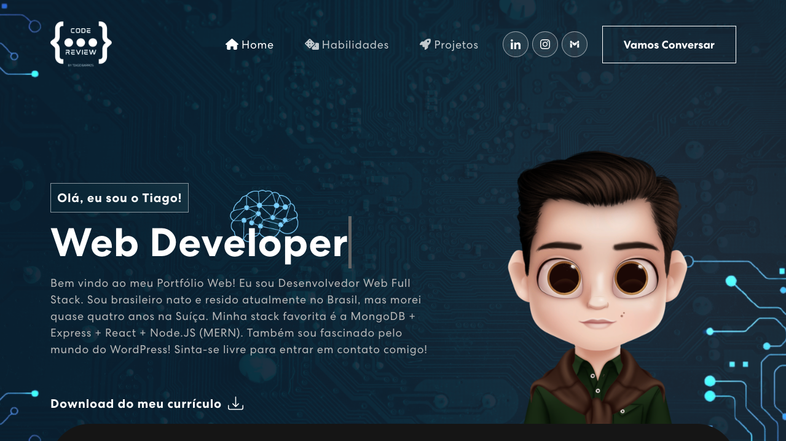

<p align="center">

  

  

  <a href="https://github.com/tiagordebarros/code-review-portfolio-web/commits/main">
    
  </a>

   
   <a href="https://github.com/tiagordebarros/code-review-portfolio-web/stargazers">

  <a href="https://codereview-2-k5416147.deta.app/">
    
  </a>

</p>

<h1 align="center">
    
</h1>

<h2 align="center">
	 Code Review 👨🏻‍💻 Portfolio Web 🚀
</h2>

<p align="center">
 <a href="#-sobre-o-projeto">Sobre</a> •
 <a href="#%EF%B8%8F-funcionalidades">Funcionalidades</a> •
 <a href="#-layout">Layout</a> •
 <a href="#-como-executar-o-projeto">Como executar</a> •
 <a href="#-tecnologias">Tecnologias</a> •
 <a href="#-agradecimentos">Agradecimentos</a> •
 <a href="#-autor">Autor</a> •
 <a href="#user-content--licença">Licença</a>
</p>


<p align="center">
<a href="https://tiagordebarros.github.io/code-review-portfolio-web/">- 🖥 Ver ao vivo -</a>
</p>

---

## 💻 Sobre o projeto

👨🏻‍💻 Code Review - Portfolio Web - é um PWA desenvolvido para realizar a apresentação de portfólio de projetos pessoais e profissionais.

---

## ⚙️ Funcionalidades

 - [x] Donwload do currículo em formato PDF
 - [x] Links para as redes sociais
 - [x] Apresentação das principais habilidades através de stacks
 - [x] Apresentação dos projetos desenvolvidos em caráter
	 - [x] Educacional
	 - [x] Profissional
	 - [x] Protótipos
 - [x] Envio de mensagemns de contato
 - [x] Validação dos campos dos formuários
 - [x] Assinatura de newsletter via Sendinblue API
 - [x] Proteção dos formulários com reCAPTCHA
 - [x] APP otimizados para dispositivos mobiles (PWA)

---

## 🎨 Layout

O layout da aplicação para computadores e celulares:


### Mobile e Web

<p align="center">
  
</p>

---

## 🚀 Como executar o projeto

Este projeto é divido em duas partes:
1. Backend (lado do servidor)
2. Frontend (lado do cliente)

>💡Dica: <br> O "Backend" e o "Frontend" se encontram em diretórios de nome homônimo, na raís do projeto.

### Pré-requisitos

Antes de começar, você vai precisar ter instalado em sua máquina as seguintes ferramentas:
[Git](https://git-scm.com), [Node.js](https://nodejs.org/en/).
Além disso, sugiro que você faça uso de um bom editor de código, como por exemplo o [VSCode](https://code.visualstudio.com/).

>💡Dica: <br> Se preferir, você pode utilizar a extensão [runme](https://runme.dev/) para executar todos os comandos diretamente do readme.

#### 💻 Rodando a aplicação

1. Clone este repositório:
```bash
$ git clone git@github.com:tiagordebarros/code-review-portfolio-web.git
```

2. Acesse o diretório do  projeto via terminal
```bash:
$ cd code-review-portfolio-web
```

>⚠️ Atenção: <br> Para ter acesso à ***100% das funcionalidades*** da aplicação, você deverá renomear o arquivo **.env.example** para **.env** e substituir todas as variáveis de ambiente pelas suas variáveis locais. Há um arquivo .env.example no diretório do ***backend*** e outro no do ***frontend***.
##### 🌐 Rodando o Servidor(Backend)

3. Vá para o diretório do backend:
```bash:
$ cd backend
```
4. Instale as dependências:
```bash:
$ npm install
```
5. Execute a aplicação em modo de desenvolvimento:
```bash:
$ npm run dev
```

6. Acesse o servidor na porta 3001:
```bash:
start http://localhost:3001
```
>💡Dica: <br> Você pode utilizar o botão abaixo para conferir quais são as rotas diposníveis no backend e quais são os seus retornos.

[](https://god.gw.postman.com/run-collection/23988041-73942fb6-4235-4d55-8066-7a11c459ce87?action=collection%2Ffork&collection-url=entityId%3D23988041-73942fb6-4235-4d55-8066-7a11c459ce87%26entityType%3Dcollection%26workspaceId%3Db49e0c04-1ac3-49b2-b81a-d81be53af02b)

##### 🖥 Rodando a aplicação Web (Frontend)

7. Vá para o diretório do frontend:
```bash:
$ cd frontend
```
8. Instale as dependências:
```bash:
$ npm install
```
9. Execute a aplicação em modo de desenvolvimento:
```bash:
$ npm start
```

10. Acesse o cliente na porta 3000:
```bash:
start http://localhost:3000
```

---

## 🛠 Tecnologias

As seguintes ferramentas foram usadas na construção desse projeto:

#### **Frontend** ([React](https://reactjs.org/))

-   **[Emailjs](https://www.emailjs.com/)**
-   **[Font Awesome](https://fontawesome.com/)**
-   **[React Router Dom](https://reactrouter.com/)**
-   **[Testing Library](https://testing-library.com/)**
-   **[Animate.css](https://animate.style/)**
-   **[Axios](https://axios-http.com/)**
-   **[Bootstrap](https://getbootstrap.com/)**
-   **[React Bootstrap](https://react-bootstrap.github.io/)**
-   **[React Icons](https://react-icons.github.io/)**
-   **[React Responsive Carousel](https://react-responsive-carousel.js.org/)**
-   **[React Router](https://reactrouter.com/en/main)**
-   **[reCAPTCHA](https://www.google.com/recaptcha/about/)**

> Para a lista completa, veja o arquivo [package.json](frontend/package.json)

#### **Backend** ([NodeJS](https://nodejs.org/en/))

-   **[Express](https://expressjs.com/)**
-   **[CORS](https://expressjs.com/en/resources/middleware/cors.html)**
-   **[dotENV](https://github.com/motdotla/dotenv)**
-   **[SendinBlue's API v3](https://www.npmjs.com/package/sib-api-v3-sdk)**
-   **[Nodemon](https://nodemon.io/)**

> Para a lista completa, veja o arquivo [package.json](backend/package.json)

#### **Utilitários**

-   API: **[SendinBlue's API v3](https://www.npmjs.com/package/sib-api-v3-sdk)**
-   Editor:  **[Visual Studio Code](https://code.visualstudio.com/)**  → Extensions:  **[PWA Builder](https://www.pwabuilder.com/)**
-   Markdown:  **[StackEdit](https://stackedit.io/)**,  **[Editor.md](https://pandao.github.io/editor.md/en.html)**
-   Commit convention:  **[Conventional Commits](https://www.conventionalcommits.org/en/v1.0.0/)**
-   Readme template:  **[README Ecoleta](https://github.com/tgmarinho/README-ecoleta)**
-   Testes de API:  **[Postman](https://www.postman.com/)**
-   Ícones:  **[React Icons](https://react-icons.github.io/)**,  **[Font Awesome](https://fontawesome.com/)**
-   Fontes:  **[CentraNo2](https://sharptype.co/typefaces/centra/centra-no2/)**

---

## 👩🏻‍💻 Agradecimentos

💜 Agradecimentos especiais para a Judy, criadora da versão original desse projeto👏. Você pode conferir a versão desenvolvida por ela, clicando neste [link](https://github.com/judygab/web-dev-projects/tree/main/personal-portfolio).

<table>
  <tr>
    <td align="center"><a href="https://github.com/judygab"><br /><sub><b>Judy Gab</b></sub></a><br /></td>
  </tr>
</table>

---

## 🤝 Como contribuir para o projeto

1. Faça um **fork** do projeto.
2. Crie uma nova branch com as suas alterações: `git checkout -b experimental/no-ref/my-awesome-feature`
3. Salve as alterações e crie uma mensagem de commit contando o que você fez: `git commit -m "feat: add new awesome feature"`
4. Envie as suas alterações: `git push -u origin experimental/no-ref/my-awesome-feature`

<br>

>⚠️ Atenção: <br> Por favor, faça uso da convenção [Conventional Commits](https://www.conventionalcommits.org/en/v1.0.0/) ao escrever os seus *commits*. Caso prefira, você pode utilizar uma das seguintes ferramentas para lhe auxiliar a escrever *commits* mais rápidos no padrão solicitado. Segue: [VS Code Conventional Commits](https://marketplace.visualstudio.com/items?itemName=vivaxy.vscode-conventional-commits), [commitlint](https://commitlint.js.org/), [OpenCommit](https://github.com/di-sukharev/opencommit).

---

## 👨🏻‍💻 Autor

<table>
  <tr>
    <td align="center"><a href="https://github.com/tiagordebarros"><br /><sub><b>Tiago Barros</b></sub></a><br />
</td>
  </tr>
</table>

[](https://www.linkedin.com/in/tiagoribeirodebarros/)
[](mailto:tiagordebarros@gmail.com)

---

## 📝 Licença

Este projeto esta sobe a licença [MIT](./LICENSE).

Feito com ❤️ por Tiago Barros  ✉️  [Entre em contato!](https://beacons.ai/tiagordebarros)

---

## 🌎 Versões do README

[Português 🇧🇷](./README.md)  |  [English 🇺🇸](./README-en.md) | [Italiano 🇮🇹](./README-it.md)

---

[⬆ Voltar ao topo](#----)<br>
